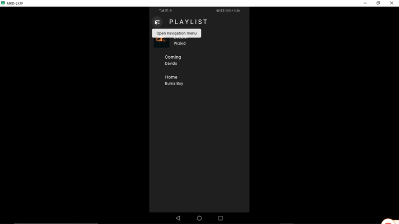

# 🚀 Vibes

# Description

A simple music player app with control functionalities.

---

## 🖼️ Demo

---

## 🧠 Tech Stack

**Frontend:** Flutter  
**Other Tools:** Provider

---

## ⚙️ Setup Instructions

### 1. Clone the repo

git clone https://github.com/devdeejay27/vibes.git
cd vibes

### 2. Install dependencies

flutter clean
flutter pub get

### 3. Run the app in terminal

flutter run

## 👨‍💻 Author

Chukwudumeje Obieli
@devdeejay27

📧 dum_obieli@yahoo.com
